# FLOW: CARD Runtime and Automation Pipelines

This document is the implementation-aligned flow map for the CARD automated pipeline in this repository.  
All sequences below are based on current code paths under `audio2script_and_summarizer/`, `scripts/`, and `benchmarks/`.

## 1) System Boundary and Components

| Component | Responsibility | Primary Path |
| --- | --- | --- |
| Operator / CLI | Starts pipeline runs and sets flags/env | `python -m audio2script_and_summarizer` |
| Runtime Orchestrator | Controls Stage 1 -> 3, branch modes, duration loop, UI streaming | `audio2script_and_summarizer/run_pipeline.py` |
| DeepSeek Wrapper | Forces `--llm-provider deepseek` then delegates to runtime orchestrator | `audio2script_and_summarizer/run_pipeline_deepseek.py` |
| Stage 1: Diarization + Transcript | Optional Demucs, Whisper transcription, alignment, diarization, transcript outputs | `audio2script_and_summarizer/diarize.py` |
| Stage 1.5: Speaker Splitter | Extracts per-speaker prompt WAV clips from diarization JSON | `audio2script_and_summarizer/audio_splitter.py` |
| Stage 1.75: WPM Calibration | Derives speaking rate from TTS preflight or transcript timing | `audio2script_and_summarizer/tts_pacing_calibration.py`, `audio2script_and_summarizer/transcript_wpm.py` |
| Stage 2: OpenAI Summarizer | Produces summary JSON with source/speaker validation | `audio2script_and_summarizer/summarizer.py` |
| Stage 2: DeepSeek Summarizer | Produces summary JSON with agentic/local tool loop and report sidecar | `audio2script_and_summarizer/deepseek/core.py` via `audio2script_and_summarizer/summarizer_deepseek.py` |
| Stage 3: Voice Resynthesis | IndexTTS2 synthesis, optional Mistral interjections, merge/export | `audio2script_and_summarizer/stage3_voice.py` |
| DeepSeek Stream Router | Parses `[DEEPSEEK_STREAM]` markers and updates dashboard | `audio2script_and_summarizer/deepseek/stream_events.py` |
| Quality Gate Automation | Runs `ruff`, `mypy`, `pytest`, validates JUnit, writes evidence artifacts | `scripts/quality_gate.py` |
| Voice Clone Benchmark | Runs objective/subjective evaluation and writes benchmark artifacts | `benchmarks/voice_clone/runner.py` |

## 2) Primary End-to-End Runtime Flow

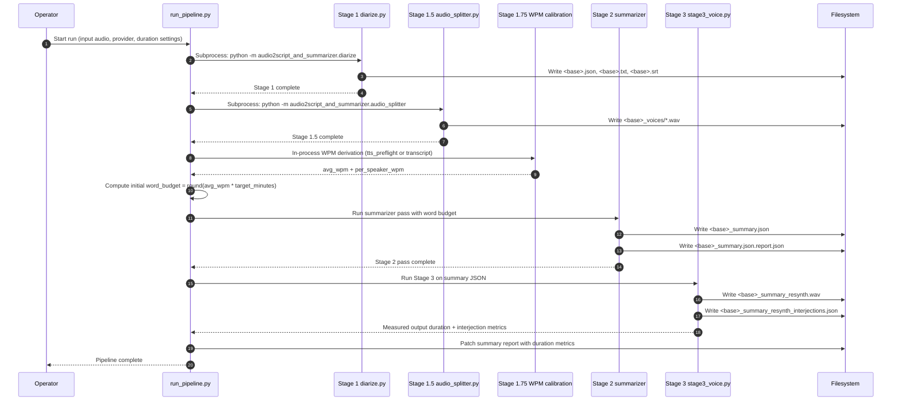

Entry condition: full mode (no `--skip-a2s`, no `--skip-a2s-summary`).  
Exit artifacts: transcript artifacts, speaker WAVs, summary JSON/report, final resynthesized WAV, interjection log.

## 3) Runtime Branches and Modes

### 3.1 Provider Branch (OpenAI vs DeepSeek)

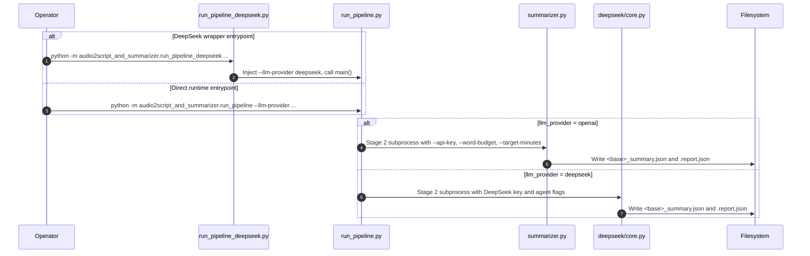

### 3.2 `--skip-a2s` Branch

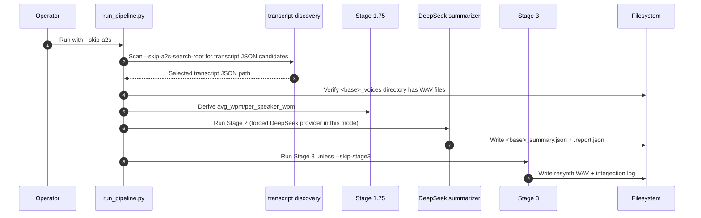

### 3.3 `--skip-a2s-summary` Branch

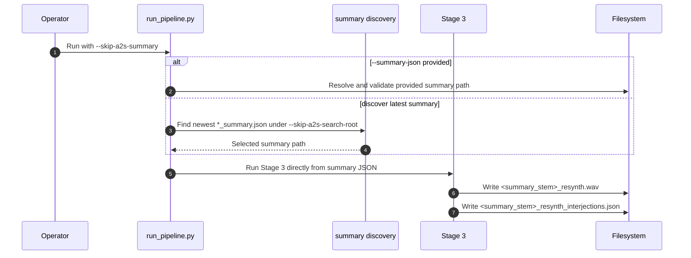

### 3.4 `--skip-stage3` Branch

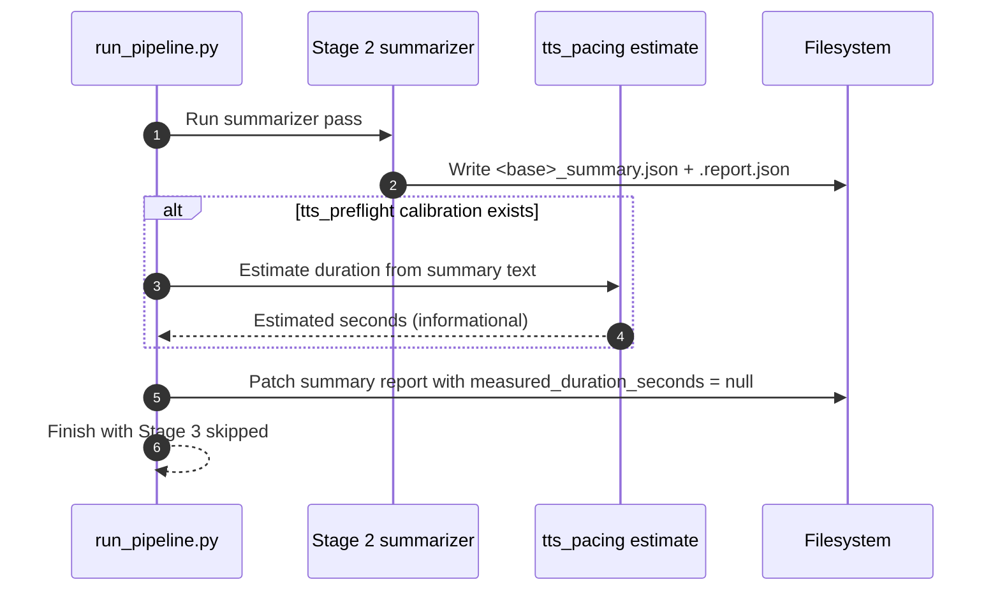

## 4) Stage-Level Internal Sequences

### 4.1 Stage 1 Internal (Diarization + Transcript Generation)

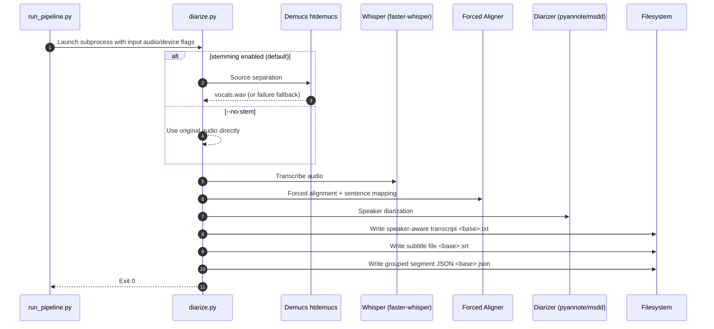

Entry condition: `--input` path is available in full mode.  
Primary Stage 1 outputs consumed downstream: `<base>.json` (by Stage 1.5/1.75/2), `<base>.txt`, `<base>.srt`.

### 4.2 Stage 1.5 Internal (Speaker Sample Extraction)

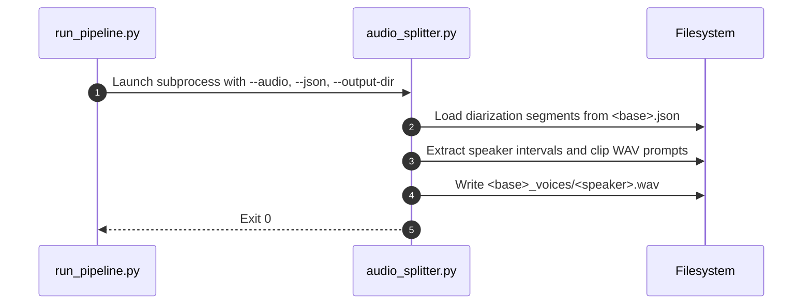

### 4.3 Stage 1.75 Internal (WPM Source Branch)

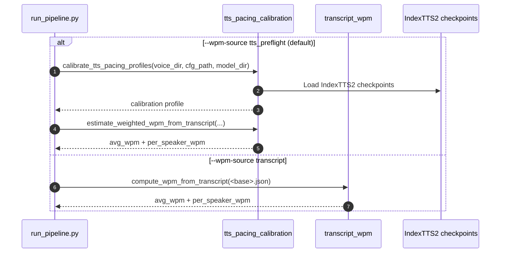

### 4.4 Stage 2 + Stage 3 Duration Correction Loop

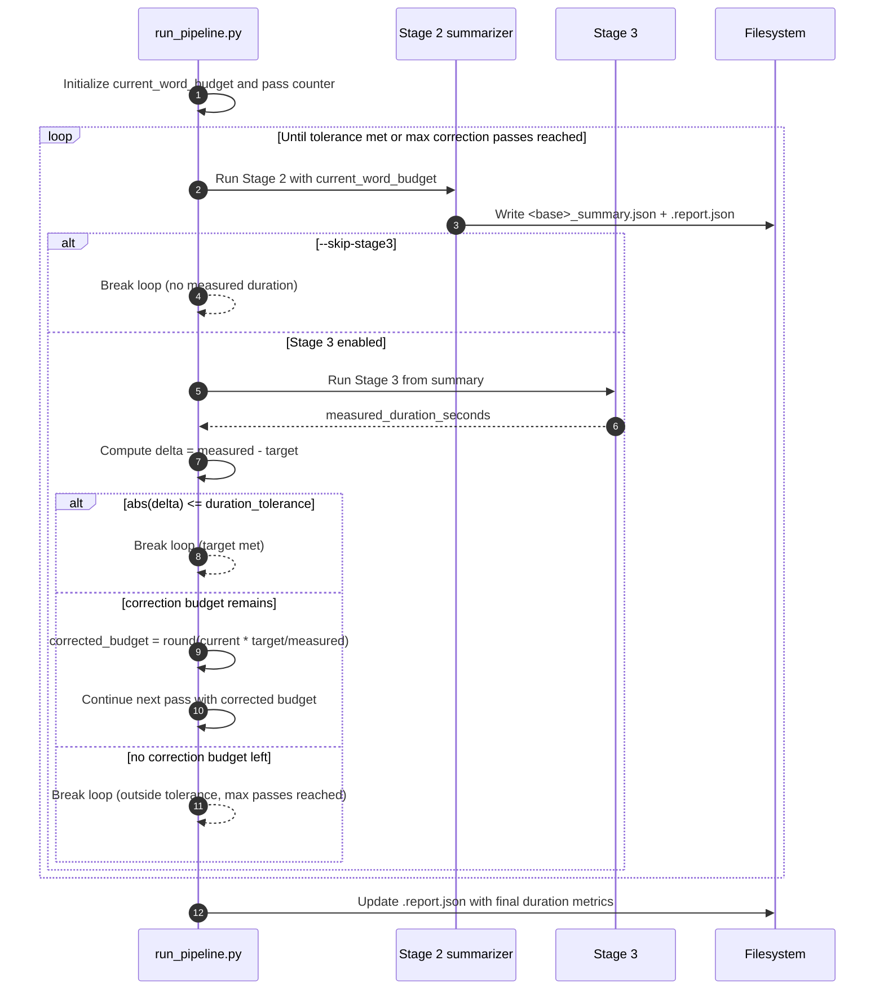

### 4.5 DeepSeek Agentic Tool Loop (Stage 2 Internal)

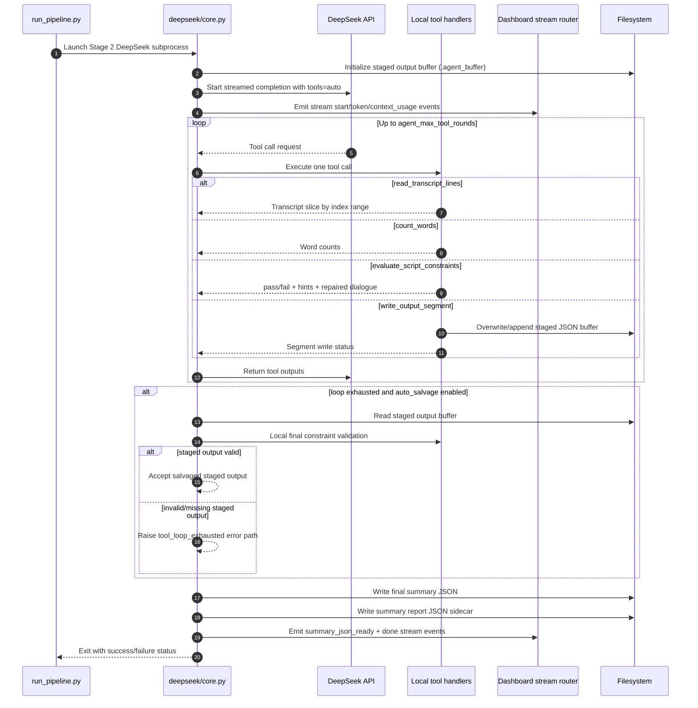

### 4.6 OpenAI Summarizer Validation/Retry Flow

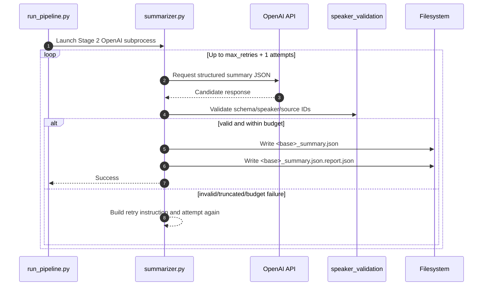

### 4.7 Stage 3 Internal (IndexTTS2 + Optional Interjections)

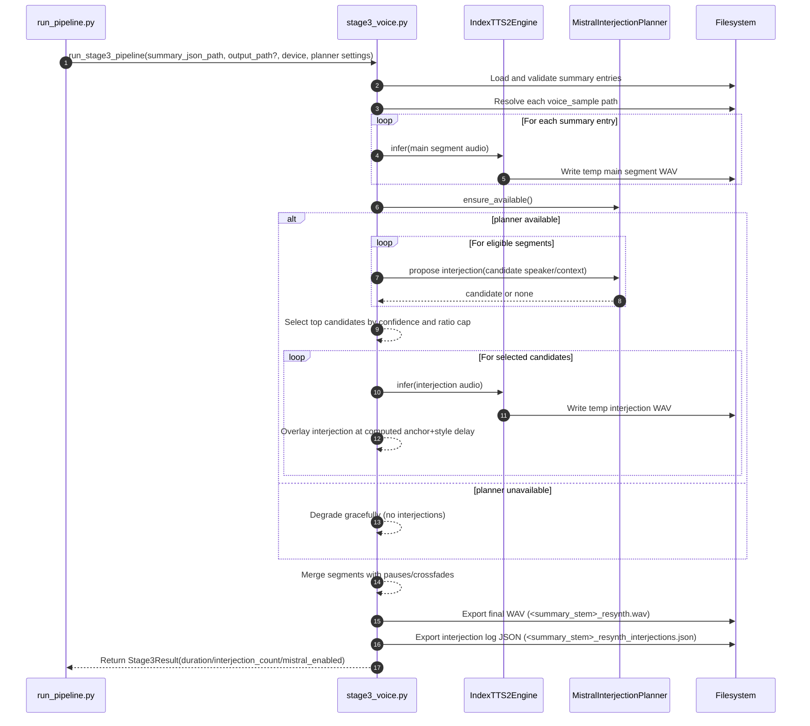

## 5) Artifact Lineage and Contracts

| Artifact | Producer | Consumer(s) | Notes |
| --- | --- | --- | --- |
| `<base>.json` | Stage 1 `diarize.py` | Stage 1.5, Stage 1.75, Stage 2 | Grouped diarized transcript segments |
| `<base>.txt` | Stage 1 | Human/operator | Speaker-aware transcript text |
| `<base>.srt` | Stage 1 | Human/operator/media tools | Subtitle transcript |
| `<base>_voices/*.wav` | Stage 1.5 `audio_splitter.py` | Stage 2, Stage 3 | Per-speaker prompt clips |
| `<base>_summary.json` | Stage 2 summarizer | Stage 3 | Structured dialogue lines with speaker + voice_sample + emotion controls |
| `<base>_summary.json.report.json` | Stage 2 summarizer, then patched by runtime | Operator, audit scripts | Includes validation/retry/tool-loop metrics; runtime adds duration delta/tolerance fields |
| `<summary_stem>_resynth.wav` | Stage 3 | Operator/downstream media | Final synthesized audio |
| `<summary_stem>_resynth_interjections.json` | Stage 3 | Operator/debugging | Interjection placement metadata |
| `artifacts/quality/<run_id>/report.json` | `scripts/quality_gate.py` | Merge/review verification | Canonical machine-readable quality evidence |
| `artifacts/quality/<run_id>/pytest.junit.xml` | `scripts/quality_gate.py` | Evidence validation | Must report tests > 0 and failures/errors = 0 for valid pass claim |
| `benchmarks/runs/<timestamp>/metrics_summary.json` | Benchmark runner | Analysts | Aggregate benchmark metrics + artifact pointers |

## 6) Auxiliary Automated Pipelines

### 6.1 Quality Gate Evidence Pipeline

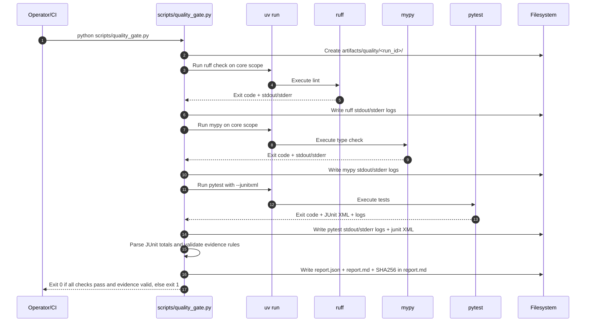

### 6.2 Voice Clone Benchmark Pipeline

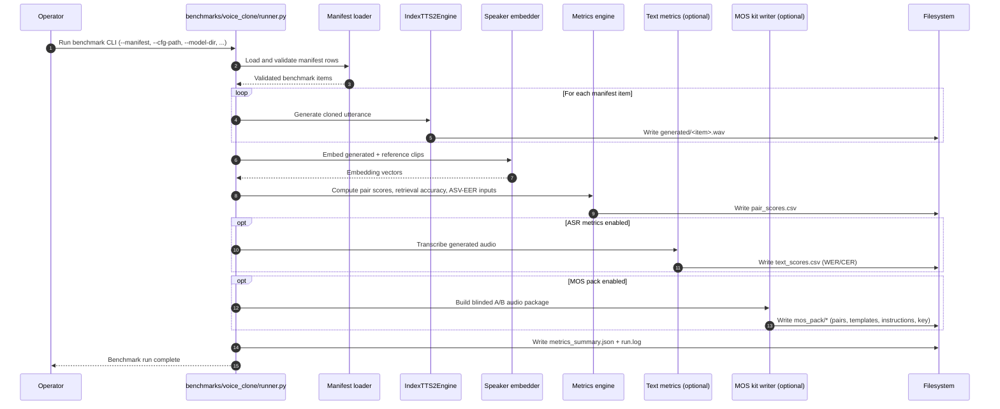

## 7) Failure, Retry, and Degradation Paths

| Area | Failure Mode | Runtime Behavior |
| --- | --- | --- |
| Stage subprocesses | Non-zero exit from Stage 1/1.5/2 | Runtime stops and returns failure |
| Stage 1 source separation | Demucs failure | Falls back to original audio for transcription |
| Stage 1 environment | `HF_TOKEN` missing | Interactive prompt in `diarize.py` import/main path; may block non-interactive execution |
| Stage 1.5 outputs | No WAV clips produced | Runtime fails with explicit error |
| Stage 2 credentials | Missing OpenAI/DeepSeek API key | Runtime fails before summarizer run |
| Stage 2 schema/constraints | Invalid model output | Summarizer retry loop (OpenAI and DeepSeek paths) |
| DeepSeek tool loop | Max rounds exhausted | Auto-salvage staged output if configured; otherwise fail with diagnostics |
| Stage 3 planner | Mistral unavailable | Degraded success with zero interjections; synthesis still completes |
| Duration control | Output outside tolerance | Re-run Stage 2/3 with corrected word budget until max correction passes reached |
| Quality gate evidence | Missing/invalid JUnit or failing checks | `report.json` status `fail`; script exits non-zero |

## 8) Observability and Logs

| Channel | Source | What it Captures |
| --- | --- | --- |
| Runtime orchestrator logs | `run_pipeline.py` via `logging_utils.configure_logging` | Stage transitions, subprocess command lifecycle, duration checks |
| Dashboard stream pane | `run_pipeline.py` + `deepseek/stream_events.py` | DeepSeek token stream, context usage, completion markers |
| Stage-specific logs | stage modules using `logging` | Stage internals and warnings |
| DeepSeek chat traces | `deepseek/core.py` | NDJSON trace events and run metadata under `deepseek_chat_logs/` |
| Quality evidence logs | `scripts/quality_gate.py` | Per-step stdout/stderr and consolidated report |
| Benchmark logs | `benchmarks/voice_clone/runner.py` | Run lifecycle, metric summary pointers, and `run.log` |

## 9) Reality Notes (Current Repo vs Stale Docs)

1. `run_pipeline.py` currently has no `--config` or `CARD_CONFIG_PATH` support in code, even though root `README.md` references config-based output routing.
2. Root `README.md` references `scripts/run_audio2script.py`, `scripts/run_audio2script_deepseek.py`, and `scripts/run_separation.py`; these files are not present in the current repository tree.
3. Root `README.md` references `docs/CONFIGURATION.md`, `docs/ARCHITECTURE.md`, and `docs/STRUCTURE.md`; a `docs/` directory is not present in the current repository tree.
4. The canonical runtime orchestrator in this repo is `audio2script_and_summarizer/run_pipeline.py`, with `run_pipeline_deepseek.py` as the DeepSeek-only shim.
