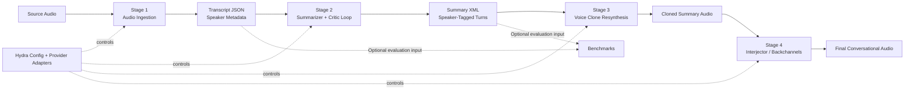

# CARD Framework

This repository is the current implementation of **CARD: Constraint-aware Audio
Resynthesis and Distillation**, the project described in
[`EEE_196_CARD_UCL.md`](./EEE_196_CARD_UCL.md).

The paper is the conceptual and academic baseline. The codebase, however, has
already moved beyond parts of the manuscript's original implementation plan.
This README therefore prioritizes **what the repository actually does now**.
When the paper and the current code diverge, treat the code, config, and
`coder_docs` as the source of truth for day-to-day development.

## Paper Metadata

**Authors**

- Rei Dennis Agustin, 2022-03027, BS Electronics Engineering
- Sean Luigi P. Caranzo, 2022-05398, BS Computer Engineering
- Johnbell R. De Leon, 2021-01437, BS Computer Engineering
- Christian Klein C. Ramos, 2022-03126, BS Electronics Engineering

**Research Adviser**

- Rowel D. Atienza

**Affiliation**

- University of the Philippines Diliman
- December 2025

## Abstract

CARD addresses the long-form podcast consumption bottleneck by generating a
shorter conversational audio output that retains speaker identity and
prosodic character instead of collapsing everything into plain text. The
project combines transcript generation, speaker-aware summarization,
voice-cloned resynthesis, and conversational overlap handling so a
multi-speaker recording can be compressed toward a user-defined duration
without discarding the listening experience that makes the original medium
valuable.

## High-Level Architecture



## What CARD Does

CARD is a multi-stage pipeline for converting long-form multi-speaker audio into
a shorter, speaker-aware, resynthesized conversational output.

At a high level, the repository currently supports:

- **Stage 1: Audio ingestion and transcript generation**
  - Source separation
  - ASR, diarization, and alignment
  - Transcript JSON generation with speaker metadata
- **Stage 2: Constraint-aware summarization**
  - Summarizer and critic agent loop
  - Duration-first summary generation with speaker-tagged XML output
  - Retrieval-backed or full-transcript summarization paths
- **Stage 3: Voice cloning and resynthesis**
  - Speaker sample generation
  - Voice-cloned rendering of summary turns
  - Live-draft voice cloning during summarizer edits
- **Stage 4: Conversational interjection**
  - Optional overlap and backchannel synthesis on top of the cloned summary
- **Benchmarking and evaluation**
  - Summarization benchmark workflows
  - Source-grounded QA benchmark workflows
  - Diarization benchmark workflows

## Paper vs. Current Repository

[`EEE_196_CARD_UCL.md`](./EEE_196_CARD_UCL.md) explains the original CARD paper,
problem framing, and proposed module design. The repository now reflects a more
developed engineering system than that initial write-up.

Important differences from the manuscript-level description include:

- The repo is now **configuration-driven** through Hydra instead of being tied
  to one fixed experimental path.
- The runtime is now **duration-first**, centered on `target_seconds` and
  tolerance checks, rather than a simple word-budget-only workflow.
- The summary output contract is now **speaker-tagged XML**, which feeds the
  downstream voice-clone and interjector stages.
- The default stage-2/stage-3 flow can use **live-draft voice cloning**, where
  turn audio is rendered during summary editing instead of only after the final
  draft is approved.
- The repository includes substantial **benchmarking, evaluation, and operator
  tooling** that goes beyond the initial paper narrative.
- Provider support has expanded: the codebase is organized around adapters and
  config-selected backends rather than a single hardcoded model stack.

In short: the paper explains **why CARD exists**; this repository captures
**how CARD currently works**.

## Repository Layout

```text
src/card_framework/
  agents/           A2A executors, DTOs, tool loops, client transport
  audio_pipeline/   Audio ingestion, speaker samples, voice cloning, interjector
  benchmark/        Summarization, QA, and diarization benchmarks
  cli/              Runtime, setup, calibration, matrix, and eval entrypoints
  config/           Hydra configuration
  orchestration/    Transcript DTOs and stage orchestration
  prompts/          Jinja2 prompt templates
  providers/        LLM and embedding provider adapters
  retrieval/        Transcript indexing and retrieval
  runtime/          Runtime planning and execution support
  shared/           Shared utilities, events, and logging
  _vendor/index_tts/
```

Other important locations:

- `artifacts/`: generated transcripts, cloned audio, benchmark outputs, and
  other runtime artifacts
- `checkpoints/`: local model/runtime checkpoints
- `coder_docs/`: repository-specific architecture, workflow, and maintenance
  guidance

## Common Commands

```bash
uv sync --dev
uv run python -m card_framework.cli.main --help
uv run python -m card_framework.cli.setup_and_run --help
uv run python -m card_framework.cli.calibrate --help
uv run python -m card_framework.cli.run_summary_matrix --help
uv run python -m card_framework.benchmark.run --help
uv run python -m card_framework.benchmark.diarization --help
uv run python -m card_framework.benchmark.qa --help
uv run ruff check .
uv run pytest
```

Common execution entrypoints:

```bash
uv run python -m card_framework.cli.setup_and_run --audio-path <path-to-audio>
uv run python -m card_framework.cli.main
uv run python -m card_framework.cli.calibrate
```

## Documentation

- [`EEE_196_CARD_UCL.md`](./EEE_196_CARD_UCL.md): the CARD paper and project
  manuscript
- [`coder_docs/codebase_guide.md`](./coder_docs/codebase_guide.md): current
  architecture, runtime flow, commands, and maintenance expectations
- [`coder_docs/memory/errors_and_notes.md`](./coder_docs/memory/errors_and_notes.md):
  repository memory for recurring pitfalls and prior fixes
- [`coder_docs/fault_localization_workflow.md`](./coder_docs/fault_localization_workflow.md):
  bug triage and failing-test workflow

If you are changing behavior, prompts, workflows, or commands, start with
`coder_docs/codebase_guide.md`.

## License

This repository is source-available under
[`LICENSE.md`](./LICENSE.md), using the **PolyForm Noncommercial 1.0.0**
license. Noncommercial use is allowed; commercial use requires separate
permission from the licensors.
